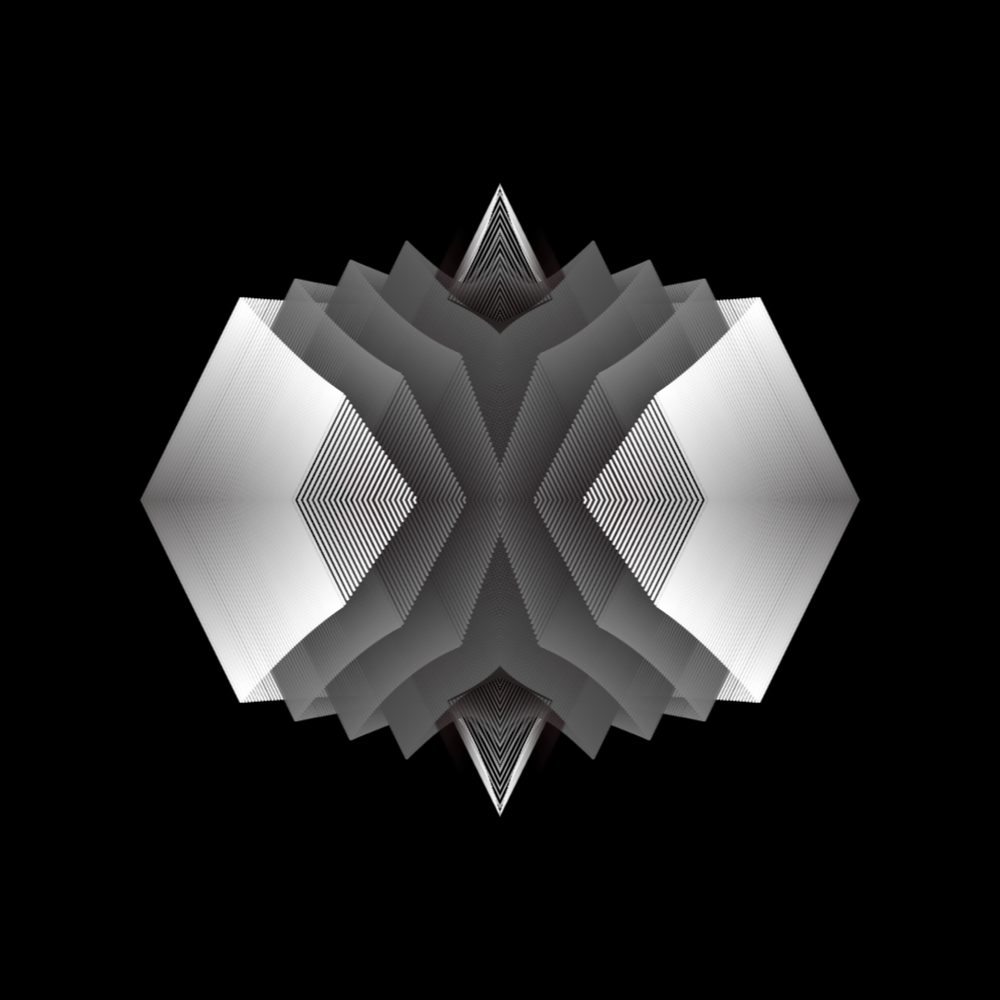
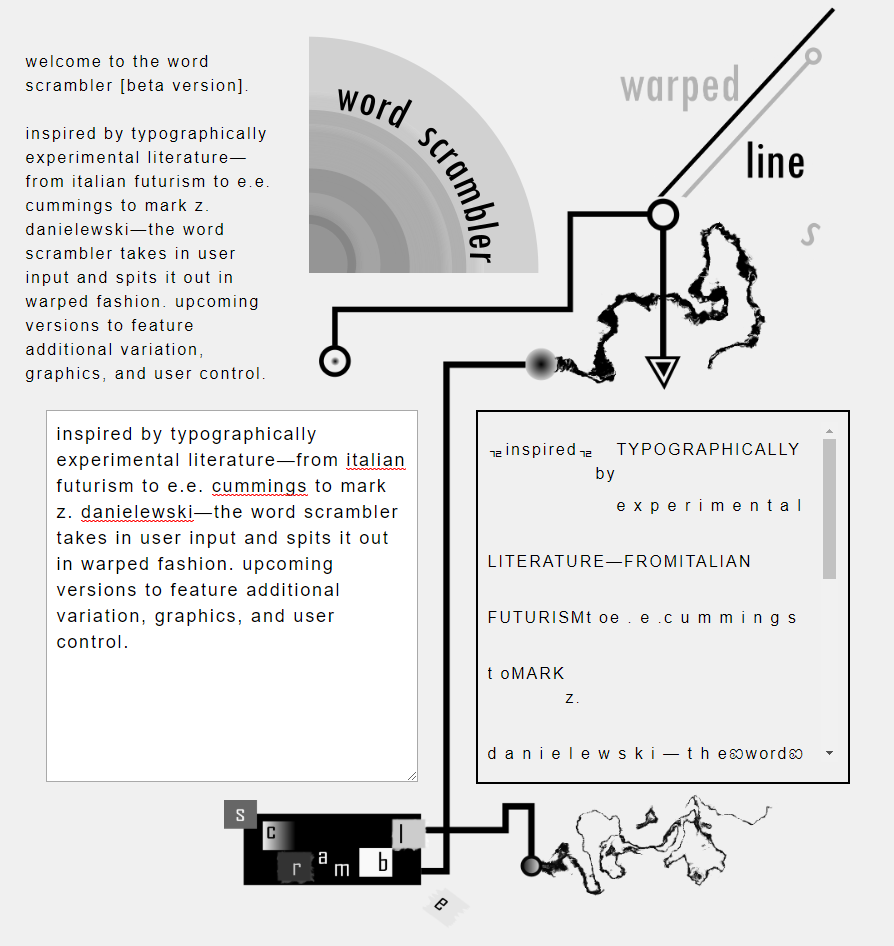

# warped // lines

warpedlines contains a portfolio for my digital art, a professional website for client contact, as well as a word scrambler program that produces typographically experimental prose-poetry based on user input. 

  

## Authors

* **Navid Ebrahimzadeh** - *initial work* - [warpedlines](https://github.com/warpedlines)

